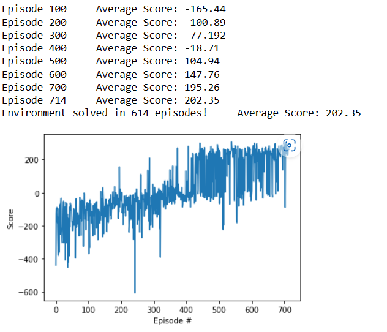
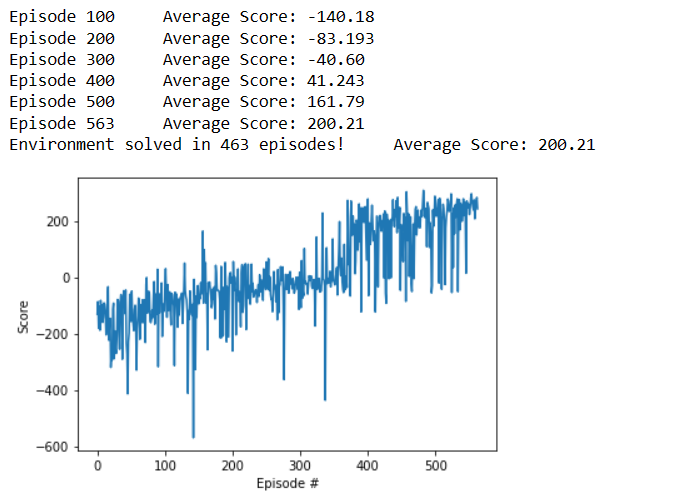
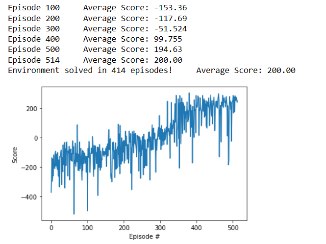

### Setting Neural network architecture
- The number of nodes on each layer equals to power of 2 of number of nodes on previous hidden layers.
- To choose number of hidden layers, I experimented serval number of hidden layers, starting from 1, 2, 3, ...
- After serveral trial, I decised to choose the architect with 2 hidden layers, because this architech will not too simple like 1 hidden layer but too complex like 3 to approximate $\hat{q}_{\pi}$

### Improving learning algorithm
- Experience Relay method: This method allow to learn from all transition and ignore the correlation between the samples

- Clipping error method: The learning cure becomes more stable than with original algrithm.

- Double Q-learning method: In the long run, this method prevent the algorithm from get high reward by chance but don't reflect the long term.

- Hyperparameter:

| Hyperparameter | Value         | Description   | 
| -------------  | ------------- | ------------- |
| minibatch size | 64 | Number of training cases|
| buffer size | 100000|
| discount factor | 0.99 | discount factor gamma|
| tau | 1e-3  | Interpolation parameter for soft update of target parameters |
| learning rate | 5e-4 | learning rate form updating local model with Adam agorithm|